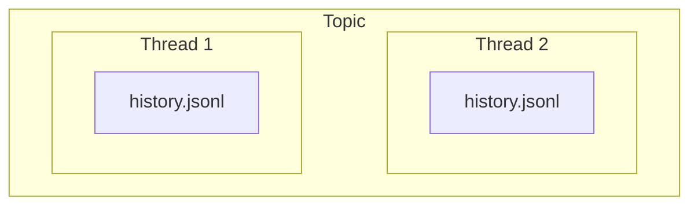

# Threads

Imagine you start sorting out your taxes with an agent, get pulled away, and come back two months later. Which agent was it? What did you already give it? Where did you stop? Do you dig through chat history in every app, or explain it all again?

Threads is a small, deliberately simple set of skills that keeps all of that in one place, as plain files on your machine: each piece of work, what you provided, what was decided, and where you left off. You can see it at a glance, and any agent can pick it up from there.

It's for any kind of work with agents: coding, research, paperwork, planning, or anything else. The files are agent-agnostic; the skills currently support Codex and Claude. It organizes your work into three pieces:

- **Topic** — an area of work, like `taxes`. It keeps related threads together so you can find them in one place.
- **Thread** — one objective within a topic, like `file-2025-return`. You can work on it across conversations and agents.
- **History** — the thread's saved context: what happened, what was decided, and what to do next. This lets the next session pick up where you left off.

Conceptually, it looks like this:



## Installation

Install the skills for Claude and Codex:

```sh
npx skills add isehrob/threads -g -a claude-code codex --skill '*'
```

## Usage

Topics group related threads. Run these skills in your agent:

- `/setup-threads` — provide a folder for your topics, or point to existing ones. Configures the installed skills to use it.
- `/create-topic` — give a topic name, like `taxes`, to group related work.
- `/create-thread` — describe what you want to work on and which topic it belongs to.
- `/list-topics` — see your topics and their latest activity.
- `/list-threads` — see threads in a topic, or across all topics.
- `/resume-thread` — pick up prior work from its saved context. If the thread is unclear, lists threads and asks you to pick.
- `/thread-handoff` — save a concise summary before stopping, ready for the next pickup.
- `/close-thread` — mark the work done and save reusable lessons in the topic's knowledge folder.

## Updates

Update installed skills with:

```sh
npx skills update -g
```

Rerun the installation command to add newly published skills. Run `/setup-threads` after updates or installations to configure the paths again.

## Storage and privacy

Topics and threads live in the location you choose. Choose a folder outside your Git repositories to keep your work separate from the installed skills and out of Git.

Put them in an iCloud Drive, Google Drive, or another synced folder for copies across devices. Access and recovery depend on your storage and account settings.

## To-do

- [ ] Automate `thread-handoff`.
